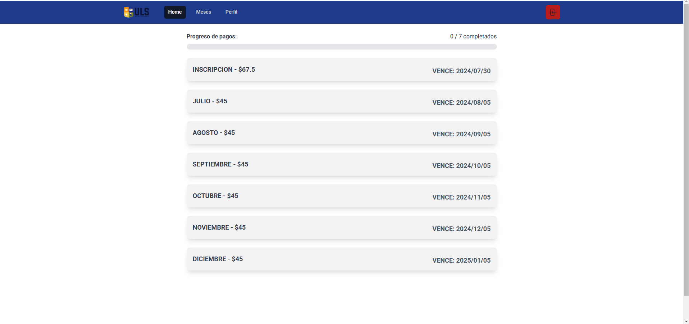

# Pagos-ULuterana

Prototipo pensado para que los estudiantes de la Universidad Luterana Salvadoreña poder realizar pagos en línea
Implementado con la SDK de Paypal para JavaScript

## Tecnologías​ 🛠️

Html

Css

Tailwind

Typescript

Vue3

Visual Studio Code ( Editor recomendado ) ✔️

https://code.visualstudio.com/

## Clonar el proyecto

```sh
git clone https://github.com/IMoloch/pagos-uluterana-vue
```

## Vista Proyecto

[Ver Proyecto](https://pagos-uluterana.netlify.app/)

Página Info de Pokemon


Página Pokemon Random


## Customize configuration

See [Vite Configuration Reference](https://vitejs.dev/config/).

## Project Setup

```sh
npm install
```

### Compile and Hot-Reload for Development

```sh
npm run dev
```

### Type-Check, Compile and Minify for Production

```sh
npm run build
```
